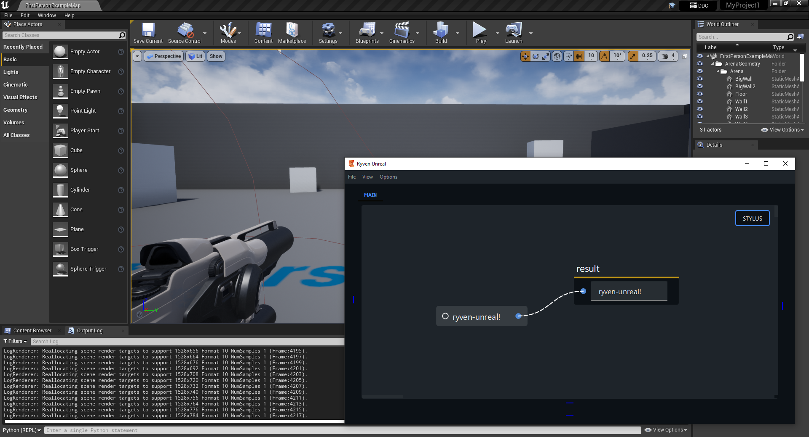

### UnrealEngine 4 Python Plugin for Ryven-like nodes editor

This repo provides a small script to load [Ryven](https://github.com/leon-thomm/ryven) as a plugin inside Unreal Engine 4, as well as the nodes package. **Notice that there are no nodes at all available yet, because I don't know the Unreal Python API well.** If you do, please consider contributing.



### setup

Using Unreal Engine's Python installation (located in something like `<UE4 path>/<version>/Engine/Binaries/ThirdParty/Python3/<your OS>/python.exe`), install Ryven

```
<UE4 Python location>$ python.exe -m pip install ryven
```

and save this repo to your file system

```
git clone https://github.com/leon-thomm/ryven-unreal
```

[comment]: <> (Alternatively, it might be possible to create your own virtual env and link UR4's Python to this env's side-packages, but I didn't try that.)

Then, assuming you have python plugins enabled in unreal, you just need to execute `__init__.py` from the Unreal Editor via `File > Execute Python Script...`. This should open a new instance of the editor. **Do not close this window if you don't want to lose the content in it**.
